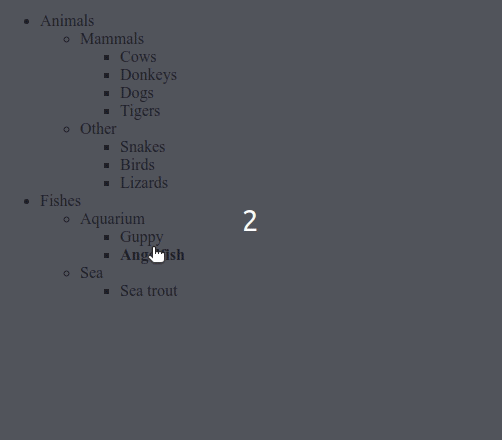

### Tree menu

- Create a tree that shows/hides node children on click:
- like this:

Requirements:

-   Only one event handler (use delegation)
-   A click outside the node title (on an empty space) should not do anything.